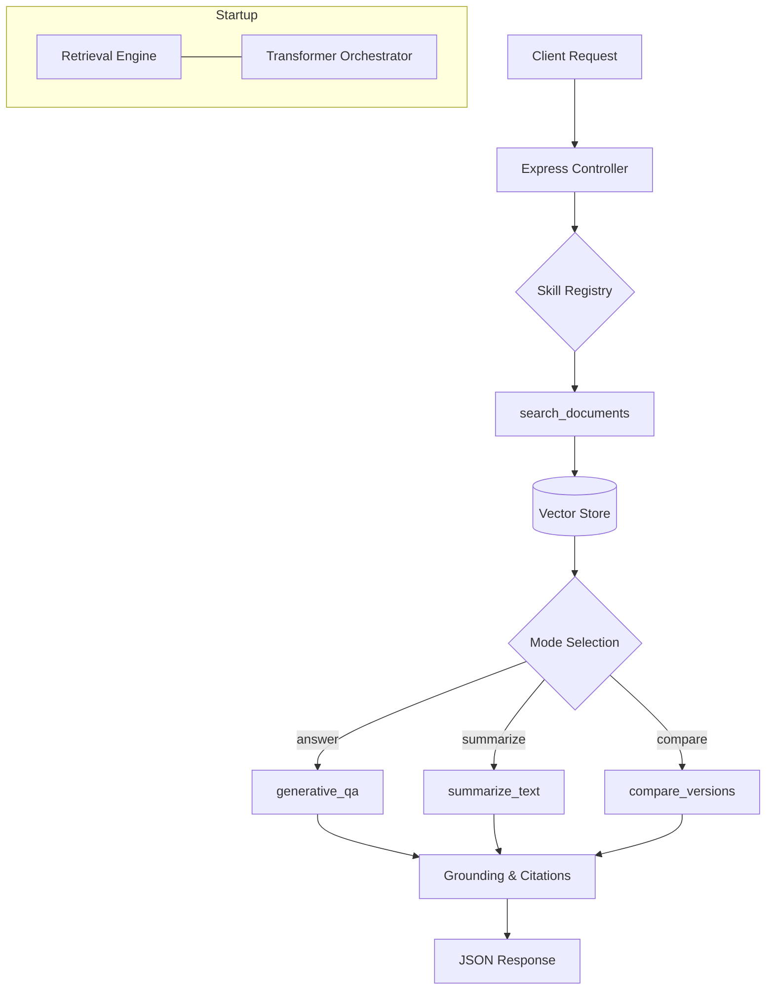

# askDocs API


A modular RAG (Retrieval-Augmented Generation) API for querying technical Markdown documentation using local transformer models powered by `@huggingface/transformers`.

## 📚 API Documentation

Explore our detailed industry-standard guides and specifications:

*   🚀 Overview – Architecture, Base URLs, and Environments.
*   🔐 Authentication – Security protocols and header requirements.
*   📝 Conventions – Response formats, rate limits, and error models.
*   📍 Endpoints – Full API reference and interactive examples.
*   📦 Models – Request and Response data schemas.
*   🪝 Webhooks – Real-time event notifications (Alpha).
*   💻 SDKs & Examples – Implementation guides in Python, JS, Java, and more.
*   🧪 Testing – Sandbox usage and sample data.
*   📜 Changelog – Version history and migration notes.
*   📖 Glossary – Domain terms and acronyms.

---

## 📋 Table of Contents
- Quick Start
- Usage Examples
- System Monitoring
- Technical Details

---

## 🚀 Quick Start (Local Setup)

### 1. Installation
Install the project dependencies:
```bash
npm install
```

### 2. Environment Configuration
Create a `.env` file in the root directory. You can use the following defaults:
```dotenv
PORT=5001
NODE_ENV=development
TRANSFORMER_MODEL=Xenova/distilbert-base-cased-distilled-squad
EMBEDDING_MODEL=Xenova/all-MiniLM-L6-v2
RERANK_MODEL=Xenova/bge-reranker-base
GENERATIVE_MODEL=Xenova/flan-t5-small
SUMMARIZATION_MODEL=Xenova/t5-small
VECTOR_STORE_PATH=./vector-store/
MODEL_CACHE_DIR=./models-cache
ONNX_THREADS=4
```

### 3. Download Models
Download all required ONNX weights to your local cache. This ensures the API starts quickly:
```bash
npm run model:download
```

### 4. Run the API
Start the development server with auto-reload:
```bash
npm run dev
```

---

## 🛠 Usage Examples

The API supports multiple "modes" of interaction via the `/api/v1/query` endpoint.

### 1. Factual Q&A (`mode: answer`)
Use this to get a synthesized answer to a specific question, strictly grounded in the provided documentation.
```bash
curl -X POST http://localhost:5001/api/v1/query \
  -H "Content-Type: application/json" \
  -H "X-API-Key: your_api_key_here" \
  -d '{
    "question": "How does the cache logic handle a miss?",
    "mode": "answer"
  }'
```

### 2. Documentation Summary (`mode: summarize`)
Use this to get a concise summary of all relevant documentation sections found for a specific topic.
```bash
curl -X POST http://localhost:5001/api/v1/query \
  -H "Content-Type: application/json" \
  -d '{
    "question": "Explain the system architecture",
    "mode": "summarize"
  }'
```

### 3. Version Comparison (`mode: compare`)
Use this to identify differences, updates, or discrepancies between documentation snippets found in the store.
```bash
curl -X POST http://localhost:5001/api/v1/query \
  -H "Content-Type: application/json" \
  -d '{
    "question": "Authentication guide updates",
    "mode": "compare"
  }'
```

---

## 🏥 System Monitoring

- **Health Check**: `GET /health` - Verifies the vector store exists and all models are initialized.
- **Status**: `GET /api/v1/status` - Returns current model IDs and ONNX thread configuration.
- **Interactive Docs**: Visit `http://localhost:5001/api-docs` to use the Swagger UI.

## 🏗 Project Structure

- `src/skills/`: Modular logic ("specialists") and their behavioral instructions (.md files).
- `src/core/`: Retrieval and Transformer orchestrators.
- `src/config/`: Environment settings and model registry.

---

## 🏛️ System Architecture

The `askDocsApi` is a local-first RAG engine. It utilizes a **Skill-based Orchestration** model where a central registry manages specialized NLP tasks. All inference happens in-process on the host CPU using ONNX-optimized weights.

### 🧱 Key Components

-   **Skill Registry (`src/skills/`):** The central hub that auto-discovers and executes logic "specialists" (Search, Generative QA, Summarization, Extraction).
-   **Hybrid Retrieval Engine (`src/core/engine.ts`):** A multi-stage retrieval system combining BM25 keyword scoring and semantic vector similarity (MiniLM).
-   **Local Transformer Orchestrator (`src/core/transformerEngine.ts`):** A dedicated manager for high-concurrency extractive tasks (DistilBERT).
-   **Vector Store:** A local flat-file database containing pre-computed embeddings and document metadata.

### Data Flow Summary

Query execution follows a **Synchronous Pipeline** model:

1.  **Parallel Warmup:** At boot, `RetrievalEngine` and `TransformerOrchestrator` load models simultaneously to reduce first-hit latency.
2.  **Stage 1: Retrieval:** The `search_documents` skill queries the Vector Store.
3.  **Stage 2: Ranking:** Results are merged via RRF (Reciprocal Rank Fusion) and re-ranked by a Cross-Encoder.
4.  **Stage 3: Task Execution:** Based on the `mode`, the Registry routes the context to either the **Generative Pipeline** (T5) or the **Extractive Orchestrator** (DistilBERT).
5.  **Stage 4: Grounding:** The answer is validated against the source context to calculate a grounding score.

### 📊 System Architecture Diagram



---

## ⚙️ Technical Details

The API is configured through environment variables, allowing flexible deployment and customization.

### Environment Configuration

Key environment variables define the operational parameters of the API:

-   `PORT`: The port on which the API server listens (default: `5001`).
-   `NODE_ENV`: The application's operating environment (`development`, `production`, etc.).
-   `TRANSFORMER_MODEL`: The primary transformer model used for extractive Q&A (e.g., `Xenova/distilbert-base-cased-distilled-squad`).
-   `EMBEDDING_MODEL`: The model used for generating semantic vector embeddings (e.g., `Xenova/all-MiniLM-L6-v2`).
-   `RERANK_MODEL`: The model used for re-ranking retrieved results (e.g., `Xenova/bge-reranker-base`).
-   `GENERATIVE_MODEL`: The model for synthesizing natural language answers (e.g., `Xenova/flan-t5-small`).
-   `SUMMARIZATION_MODEL`: The model specialized for summarization tasks (e.g., `Xenova/t5-small`).
-   `MODEL_CACHE_DIR`: Local directory where models are cached (default: `./models-cache`).
-   `ONNX_THREADS`: Number of threads for ONNX runtime operations (default: `4`).
-   `VECTOR_STORE_PATH`: Path to the JSON file or directory containing JSON shards (default: `./vector-store/`).

### Model Registry

The API maintains a `MODEL_REGISTRY` (`src/config/models.ts`) that lists available transformer models, along with their IDs, estimated sizes, checksums, and a brief purpose description. This registry is exposed via the `/api/v1/metadata` and `/api/v1/config` endpoints for client-side awareness.

### Skill Registry

The `src/skills/registry.ts` module is responsible for discovering, registering, and managing various "skills" (e.g., `search_documents`, `generative_qa`, `summarize_text`). Each skill encapsulates specific logic and can have associated Markdown instruction files that guide its behavior. Skills are initialized and warmed up during application startup to minimize latency.

### Core Engines

-   **RetrievalEngine (`src/core/engine.ts`):** Manages document retrieval using a hybrid search approach (BM25 and semantic similarity) and cross-encoder re-ranking. It handles loading the vector store and initializing embedding and re-ranking models.
-   **LocalTransformerOrchestrator (`src/core/transformerEngine.ts`):** Orchestrates the loading and execution of local transformer models for tasks like extractive question answering. It ensures models are loaded from the local cache and applies ONNX optimizations.

---
# API Overview

The **askDocs API** is a high-performance, local-first Retrieval-Augmented Generation (RAG) engine designed specifically for technical Markdown documentation. It allows developers to query complex documentation sets using natural language and receive synthesized, grounded answers.

## Purpose
Technical documentation is often fragmented and difficult to navigate. This API bridges the gap by using semantic search and local Large Language Models (LLMs) to provide:
- Direct answers to factual questions.
- Topic summarization across multiple files.
- Version discrepancy analysis.

## Architecture
Unlike traditional RAG systems that rely on cloud-based LLM providers (e.g., OpenAI), `askDocs` performs all inference **in-process** on the host machine.

### Key Components
- **Retrieval Engine**: Uses a hybrid approach combining BM25 (keyword) and MiniLM (semantic) search.
- **Transformer Orchestrator**: Manages ONNX-optimized models for extraction and generation.
- **Skill Registry**: A modular framework that routes queries to specialized logic "specialists" based on the requested interaction mode.

## Base URLs
| Environment | URL |
| :--- | :--- |
| **Local Development** | `http://localhost:5001` |
| **Production (example)** | `https://api.askdocs.io` |

## Versioning
We follow Semantic Versioning (SemVer).
- Current Version: `1.0.0`
- The version is prefixed in the path: `/api/v1/`

## Environments
The API behavior is controlled via the `NODE_ENV` environment variable:
- `development`: Detailed logging, interactive Swagger docs enabled, and verbose error stacks.
- `production`: Optimized performance, thread-safe ONNX execution, and sanitized error responses.

---

### 🔗 Related Links
- Authentication
- Endpoints
- Technical Conventions
# Authentication

All requests to the askDocs API must be authenticated using an API Key. This ensures secure access to your document vector stores and protects system resources.

## API Key Security
Your API key should be kept confidential. Do not share it in public repositories or client-side code that can be inspected by users.

### Required Headers
Authentication is handled via the following custom header:

| Header | Value | Description |
| :--- | :--- | :--- |
| `X-API-Key` | `YOUR_SECRET_KEY` | Your unique API access token. |

## Example Authenticated Request

```bash
curl -X GET http://localhost:5001/api/v1/status \
  -H "X-API-Key: 12345-abcde-67890"
```

## Token Lifecycle
- **Issuance**: Keys are currently managed via the `.env` configuration or your administrative dashboard.
- **Expiration**: Keys do not expire automatically but can be revoked by the system administrator.
- **Revocation**: If a key is compromised, update your environment configuration and restart the service immediately.

## Auth Error Responses

### 401 Unauthorized
Returned if the `X-API-Key` header is missing or contains an invalid value.
```json
{
  "error": "Unauthorized",
  "message": "Missing or invalid API key in X-API-Key header."
}
```

---

### 🔗 Related Links
- API Endpoints
- Error Models
```
# Conventions

This document outlines the standard protocols and formats used by the askDocs API to ensure consistency across all integrations.

## Request/Response Formats
- **Content-Type**: All requests and responses use `application/json`.
- **Encoding**: UTF-8.
- **Timestamp Format**: ISO 8601 (`YYYY-MM-DDTHH:mm:ss.sssZ`).

## Pagination
For endpoints returning lists (e.g., search results), we use offset-based pagination.
- `limit`: Maximum number of items to return (default: 10, max: 100).
- `offset`: Number of items to skip (default: 0).

## Sorting and Filtering
Query parameters are used for sorting and filtering:
- `sort`: Field name (e.g., `sort=date`). Prefix with `-` for descending (e.g., `sort=-score`).
- `filter`: Key-value pairs (e.g., `category=docs`).

## Rate Limits
To maintain service stability, the following limits apply:
- **Developer Tier**: 100 requests per minute.
- **Production Tier**: 5,000 requests per minute.

Exceeding these limits will result in a `429 Too Many Requests` response.

## Idempotency
All `GET` and `HEAD` requests are naturally idempotent. `POST` requests to the `/query` endpoint are also idempotent as they do not modify state; however, they are not cached by the server to ensure fresh documentation analysis.

## Error Model
The API uses standard HTTP status codes. Every error response follows this schema:

| Field | Type | Description |
| :--- | :--- | :--- |
| `code` | `string` | A unique machine-readable error code. |
| `message` | `string` | A human-readable description of the error. |
| `details` | `object` | (Optional) Additional context, such as validation errors. |

### Example Validation Error (400)
```json
{
  "code": "VALIDATION_FAILED",
  "message": "The request body is malformed.",
  "details": {
    "field": "mode",
    "reason": "Must be one of: answer, summarize, compare"
  }
}
```

### Common Status Codes
- `200 OK`: Success.
- `400 Bad Request`: Validation failure or malformed JSON.
- `401 Unauthorized`: Authentication missing or invalid.
- `404 Not Found`: Resource or endpoint does not exist.
- `429 Too Many Requests`: Rate limit exceeded.
- `500 Internal Server Error`: Unexpected server-side failure.

---

### 🔗 Related Links
- Models Specification
- Authentication Guide
# Endpoints Reference

Detailed documentation for every available API endpoint.

## 1. Query API

### `POST /api/v1/query`
**Summary**: Execute a RAG query against the document store.

#### Parameters
- **Headers**:
  - `X-API-Key` (Required): Your API authentication key.

#### Request Body
See QueryRequest for schema details.
```json
{
  "question": "string",
  "mode": "answer | summarize | compare",
  "top_k": 5
}
```

#### Response Schema (Success 200)
Returns a QueryResponse object.

#### Example (mode: answer)
**Request**:
```bash
curl -X POST http://localhost:5001/api/v1/query \
  -d '{"question": "How to install?", "mode": "answer"}'
```
**Response**:
```json
{
  "answer": "You can install the project by running 'npm install' in the root directory.",
  "grounding_score": 0.98,
  "citations": [
    {"file": "README.md", "text": "Install dependencies using npm install"}
  ]
}
```

#### Validation Rules
- `question`: Must be at least 5 characters.
- `mode`: Restricted to the defined enum values.

#### Side Effects
None. This is a read-only operation.

---

## 2. System Status

### `GET /api/v1/status`
**Summary**: Retrieve operational metadata and model configuration.

#### Response Schema (Success 200)
```json
{
  "status": "ready",
  "models": {
    "embedding": "Xenova/all-MiniLM-L6-v2",
    "generative": "Xenova/flan-t5-small"
  },
  "onnx_threads": 4
}
```

---

## 3. Health Check

### `GET /health`
**Summary**: Simple heartbeat endpoint for monitoring services.

#### Success Example (200)
```json
{
  "status": "UP",
  "timestamp": "2024-05-21T17:41:00.000Z",
  "checks": {
    "vectorStore": "connected",
    "models": "loaded"
  }
}
```

#### Error Example (503 Service Unavailable)
Returned if the vector store path is inaccessible or models failed to initialize.
```json
{
  "status": "DOWN",
  "reason": "Vector store file not found at ./vector-store/docs.json"
}
```

---

### 🔗 Related Links
- Models Specification
- Authentication
```
# Data Models

This page defines the JSON schemas for requests and responses used by the askDocs API.

## QueryRequest
The payload sent to `POST /api/v1/query`.

| Field | Type | Required | Description |
| :--- | :--- | :--- | :--- |
| `question` | `string` | Yes | The natural language question to ask. |
| `mode` | `string` | Yes | Interaction mode: `answer`, `summarize`, or `compare`. |
| `top_k` | `integer` | No | Number of document chunks to retrieve. Default: `5`. Max: `20`. |
| `threshold` | `float` | No | Minimum similarity score (0.0 to 1.0). Default: `0.5`. |
| `filter` | `object` | No | Metadata filters (e.g., `{"category": "api"}`). |

**Example Object**:
```json
{
  "question": "What is the system architecture?",
  "mode": "summarize",
  "top_k": 3,
  "filter": { "category": "architecture" }
}
```

## QueryResponse
The payload returned by a successful query.

| Field | Type | Description |
| :--- | :--- | :--- |
| `answer` | `string` | The synthesized text answer or summary. |
| `score` | `float` | Confidence score (0.0 - 1.0) indicating factual grounding. |
| `citations` | `Array<Citation>` | List of source documents used for the answer. |
| `correlationId` | `string` | Unique identifier for request tracing. |
| `metadata` | `object` | Performance metrics including `timings` and `instructionHashes`. |

**Example Object**:
```json
{
  "answer": "The system uses a modular skill-based architecture...",
  "score": 0.95,
  "correlationId": "f852d894-f3d9-430c-954f-a5131c0abe33",
  "citations": [
    { 
      "file": "README.md", 
      "label": "System Architecture",
      "content": "The system utilizes a Skill-based Orchestration model...",
      "relevance": 0.89 
    }
  ],
  "metadata": { 
    "timings": {
      "total_inference_ms": 142
    },
    "instructionHashes": {
      "search_documents": "...",
      "generative_qa": "...",
      "extract_answer": "..."
    }
  }
}
```

## Citation
Information about a retrieved document fragment.

| Field | Type | Description |
| :--- | :--- | :--- |
| `file` | `string` | Relative path to the source Markdown file. |
| `content` | `string` | The specific text snippet retrieved. |
| `relevance` | `float` | Semantic similarity score. |

## StatusResponse
Information about the internal state of the API.

| Field | Type | Description |
| :--- | :--- | :--- |
| `status` | `string` | Current state: `initializing`, `ready`, or `error`. |
| `uptime` | `number` | Server uptime in seconds. |
| `model_cache` | `string` | Path to the local model directory. |
| `shards` | `Array<string>` | List of relative paths to loaded document shards. |
| `fileMetadata` | `object` | Mapping of shard paths to metadata (chunk counts, headings, tags). |

**Example Object**:
```json
{
  "status": "ready",
  "uptime": 3600,
  "model_cache": "./models-cache",
  "shards": ["docs/intro.json"],
  "fileMetadata": {
    "docs/intro.json": {
      "chunkCount": 5,
      "headings": ["Welcome"],
      "tags": ["guide"]
    }
  }
}
```

---

### 🔗 Related Links
- API Endpoints
- Technical Conventions

```

```

```

```